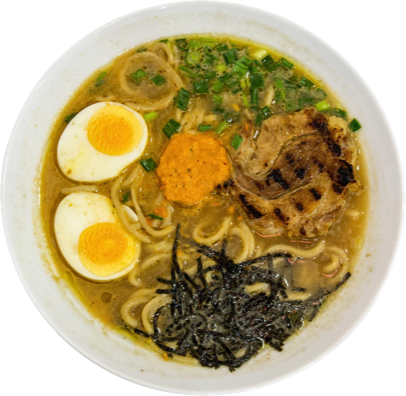

# 🍜 Sakura Ramen Website

A modern restaurant landing page built with HTML, CSS and JavaScript.

## 🔗 Live Demo
https://canfergit.github.io/Sakura-Projekt/

## 🛠️ Technologies
- HTML
- CSS
- JavaScript

## ✨ Features
- Responsive layout
- Clean UI design
- Interactive elements
- Structured menu section

## 📸 Preview

## 🚀 About
This project was built as a frontend practice project to improve layout, styling and user experience.

---

👨‍💻 Developed by Canfer
